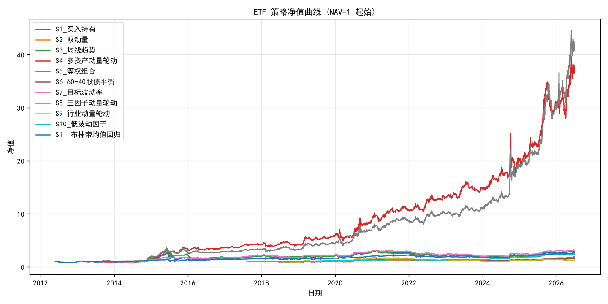
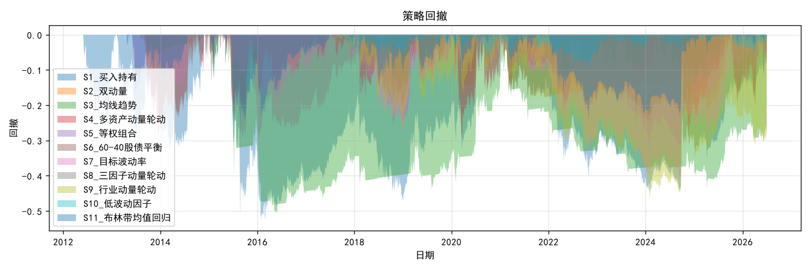

# A股 ETF 策略回测报告

> 数据时点：2026-07-01（盘后）
> 回测窗口：2012-05-28 ~ 2026-07-01（公共交易日对齐）
> 数据来源：东财 push2his 前复权日K（`fqt=1`），经 `em_get` 限流防封；本地 parquet 缓存
> 初始资金：1,000,000 | 成本：佣金万2.5+滑点万1（单边0.035%），ETF免印花税

## 指标对比表（实测）

| 策略 | 年化收益 | 年化波动 | 夏普 | 最大回撤 | Calmar | 胜率 | 年化换手 |
|---|---|---|---|---|---|---|---|
| S1_买入持有 | 8.19% | 27.48% | 0.30 | -52.97% | 0.15 | 50.61% | 0.1 |
| S2_双动量 | 5.60% | 14.43% | 0.39 | -24.58% | 0.23 | 67.59% | 3.4 |
| S3_均线趋势 | 6.99% | 19.98% | 0.35 | -50.45% | 0.14 | 65.10% | 8.4 |
| S4_多资产动量轮动 | 33.62% | 27.69% | 1.21 | -29.73% | 1.13 | 53.59% | 29.9 |
| S5_等权组合 | 7.70% | 17.40% | 0.44 | -32.93% | 0.23 | 49.60% | 0.1 |
| S6_60-40股债平衡 | 5.71% | 12.73% | 0.45 | -25.11% | 0.23 | 51.17% | 0.1 |
| S7_目标波动率 | 9.55% | 16.62% | 0.57 | -40.90% | 0.23 | 51.58% | 3.5 |
| S8_三因子动量轮动 | 34.82% | 27.44% | 1.27 | -30.14% | 1.16 | 53.43% | 36.2 |
| S9_行业动量轮动 | 2.95% | 21.20% | 0.14 | -46.03% | 0.06 | 50.30% | 6.0 |
| S10_低波动因子 | 10.89% | 7.84% | 1.39 | -9.68% | 1.13 | 53.80% | 2.3 |
| S11_布林带均值回归 | 7.93% | 16.82% | 0.47 | -34.05% | 0.23 | 53.84% | 24.9 |

| 策略 | 相对基准超额年化 |
|---|---|
| S1_买入持有（基准） | — |
| S2_双动量 | -0.10% |
| S3_均线趋势 | -2.31% |
| S4_多资产动量轮动 | 23.98% |
| S5_等权组合 | 1.99% |
| S6_60-40股债平衡 | 0.01% |
| S7_目标波动率 | 0.24% |
| S8_三因子动量轮动 | 13.70% |
| S9_行业动量轮动 | 3.25% |
| S10_低波动因子 | 5.19% |
| S11_布林带均值回归 | -1.37% |

## 净值曲线

## 回撤曲线

## 策略说明

- **S1 买入持有**：恒满仓沪深300ETF（510300），不调仓。作基准。
- **S2 双动量**：沪深300过去250日收益>0且>国债→持股；为正且<=国债→持债；为负→持货币（511880）。月末调仓。
- **S3 均线趋势**：20日线上穿60日线→持股；下穿→持货币。月末调仓。
- **S4 多资产动量轮动**：黄金(518880)/纳指(513100)/创业板(159915)/上证180(510180)四资产，25日log-price OLS回归，年化收益×R²打分，选最高分持有。每日调仓。
- **S5 等权组合**：沪深300/中证500/创业板/国债四资产等权重，季末再平衡。
- **S6 60-40**：60%沪深300+40%国债ETF（511260），季末再平衡。
- **S7 目标波动率**：实现波动率(20日)↑→降仓至 target/realized（上限100%），目标年化波动15%。月末调仓。
- **S8 三因子动量轮动**：斜率动量(年化×R²)+乖离动量(MA偏离趋势)+效率动量(方向/波动率)三因子加权打分，阈值过滤（挑战者需超leader 1.5倍才切换），每日评估。
- **S9 行业动量轮动**：7大行业ETF（医药/证券/银行/军工/酒/有色/沪深300）按60日动量排名，选Top-3等权持有，月末调仓。
- **S10 低波动因子**：跨资产ETF池（沪深300/国债/黄金/中证500/创业板/银行）按60日波动率排序，选最低3只等权持有，月末调仓。
- **S11 布林带均值回归**：20日均线±2σ布林带，价格近下轨→加仓，近上轨→减仓，动态仓位(0~100%)，周度评估。

## 风险提示与口径说明

- 回测好≠实盘好：存在过拟合风险、参数依赖（动量回看250日/均线20-60/月度调仓）。
- 成本为简化模型（佣金+滑点），未计入冲击成本（流动性差品种实际更高）。
- 信号滞后1日已处理前视偏差（t日收盘算信号，t+1日收盘执行）；前复权已处理分红除权。
- S6 简化为日日维持目标权重（未模拟季内漂移），换手率反映调仓频率。
- 标的均为2012-2013年上市长寿品种，全周期无生存者偏差。
- 本报告区分'实测值'（上表与图）与'判断'（结论性文字），实测值均来自真实行情。